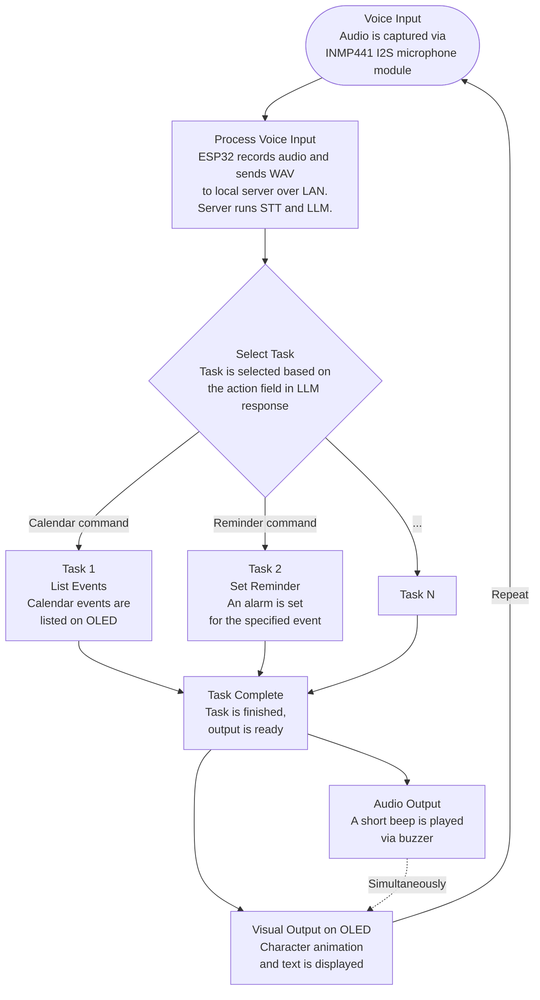

# Virtual Assistant

```mermaid
flowchart TD
    A([Voice Input<br>Audio is captured via<br>INMP441 I2S microphone module])
    B[Process Voice Input<br>ESP32 records audio and sends WAV<br>to local server over LAN.<br>Server runs STT and LLM.]
    C{Select Task<br>Task is selected based on<br>the action field in LLM response}
    T1[Task 1<br>List Events<br>Calendar events are<br>listed on OLED]
    T2[Task 2<br>Set Reminder<br>An alarm is set<br>for the specified event]
    TN[Task N]
    D[Task Complete<br>Task is finished,<br>output is ready]
    E[Audio Output<br>A short beep is played<br>via buzzer]
    F[Visual Output on OLED<br>Character animation<br>and text is displayed]

    A --> B
    B --> C
    C -->|Calendar command| T1
    C -->|Reminder command| T2
    C -->|...| TN
    T1 --> D
    T2 --> D
    TN --> D
    D --> E
    D --> F
    E -. Simultaneously .-> F
    F -->|Repeat| A
```
